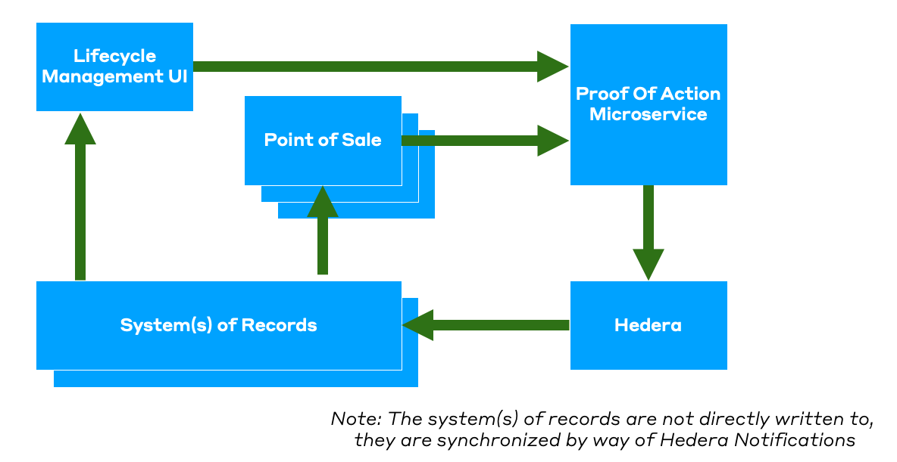

# hedera-theft-prevention-demo

Demonstrates a theft prevention use case using proof of action, the purpose of the demo is to show how a device is sold via a Point of Sale and subsequently managed in a separate systems of record.
Each activity (point of sale or lifecycle management) is recorded on Hedera using the Hedera Consensus Service, this happens through the Proof Of Action microservice which abstracts the Hedera API calls into a simple set of web services.

## Architecture and components



## Prerequisites

* Docker
* Docker-compose
* NodeJS v14.x
* git
* A Hedera Testnet account 

## Clone the repository

```shell script
$ git clone https://github.com/hashgraph/hedera-theft-prevention-demo.git
$ cd hedera-theft-prevention-demo
```

## Docker setup

TBD

## Standalone Installation

### Setup environment files

_Note:the following assumes you are in the `hedera-theft-prevention-demo` folder_

```shell script
$ cd hedera-proof-of-action-microservice
$ cp .env.sample .env
$ nano .env
```

update the following values

* HEDERA_OPERATOR_ID=0.0.xxx
* HEDERA_OPERATOR_KEY=302...
* HEDERA_TOPIC_ID=0.0.yyy (_note, if left blank a new one will be created for you, watch the console when starting the service. Copy the topic id into the `.env` file and restart the service_)

```shell script
$ cd ../backend
$ cp .env.sample .env
$ nano .env
```

update the following values

* MIRROR_ADDRESS="hcs.testnet.mirrornode.hedera.com:5600" (if you're using mainnet or previewnet, update accordinly)
* TOPIC_ID=0.0.yyy (this should match the topic id from the proof-of-action microservice `.env` file)

```shell script
$ cd ../frontend
$ cp .env.sample .env
$ nano .env
```

update the following values

* VUE_APP_TOPIC_ID=0.0.yyy (this should match the topic id from the proof-of-action microservice `.env` file)

### Starting each component

run the following commands in three separate terminals 

#### Proof of action microservice

```shell script
$ cd hedera-theft-prevention-demo/hedera-proof-of-action-microservice
$ docker-compose up
```

> poa_1  | INFO: listening on http://0.0.0.0:8080/

_note: if you didn't specify a `HEDERA_TOPIC_ID` in the `.env` file, watch the console for the automatically created entity.

> poa_1  | WARNING: created new topic ID 0.0.128718

#### backend

```shell script
$ cd hedera-theft-prevention-demo/backend
$ npm install
$ rm -f database/*
$ node migrate.js
$ node server.js
```

> start mirror listen
> Mirror startListening
> Mirror new MirrorConsensusTopicQuery() for topic Id 0.0.128718
> App running on localhost:3128

#### frontend

```shell script
$ cd hedera-theft-prevention-demo/frontend
$ npm install
$ npm run serve --disable-host-check
```

>   App running at:
>   - Local:   http://localhost:8081/
>   - Network: http://192.168.3.21:8081/

#### Launching the UI

The UI should now be available at `http://localhost:8081`
